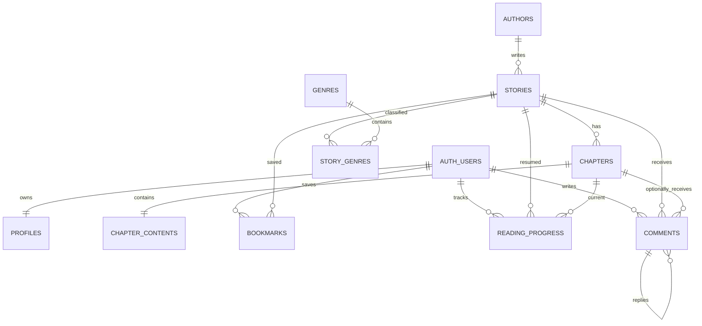

# Backend Spec: NovelVerse MVP

Cap nhat: 2026-06-19

## 1. Objective

Chuyen static prototype hien tai thanh web doc truyen co du lieu that, giu nguyen visual Ruby Noir va cac luong Home, Story Detail, Reader.

MVP backend phai ho tro:

- Doc danh sach truyen da publish.
- Doc thong tin truyen, the loai, tac gia va danh sach chuong.
- Doc noi dung chuong free da publish.
- Tim kiem truyen theo title, author va synopsis.
- Dang ky/dang nhap bang Supabase Auth.
- Bookmark truyen.
- Luu chuong doc gan nhat va tien do doc.
- Binh luan o cap story hoac chapter.
- Quan tri noi dung qua server-only code trong phase sau.

Khong thuoc migration dau:

- Thanh toan that, Gold/Xu, combo VIP.
- Entitlement mua chuong.
- Realtime comment.
- Recommendation ML/vector search.
- Notification va admin dashboard hoan chinh.

## 2. Chosen Stack

### Application

- Next.js App Router, TypeScript.
- Server Components la mac dinh.
- Client Components chi cho interaction nhu Reader settings, menu, optimistic bookmark.
- Server Actions cho mutation noi bo.
- Route Handlers chi cho webhook, auth callback hoac API can dung ben ngoai.
- Supabase JS + Supabase SSR cho data/auth client.
- Zod cho validation tai server boundary.
- Vitest cho unit/integration test; Playwright cho browser test.
- Node.js 20.9+.
- Khi scaffold: dung latest stable patched Next.js 16.x va React 19.2.4+; khong dung canary.

### Backend platform

- Supabase PostgreSQL.
- Supabase Auth.
- Supabase Storage.
- Supabase Data API cho read public va CRUD cua chinh user.
- Row Level Security tren moi table trong `public`.
- Publishable key trong browser.
- Secret key chi trong trusted server environment.

### Deployment

- Vercel cho Next.js.
- Supabase hosted project cho database/auth/storage.

## 3. Architectural Decisions

### 3.1 Data access

- Public pages duoc render bang Server Components.
- Shared public content co the cache va invalidate theo tag sau mutation admin.
- Personalized data nhu bookmark/progress khong dung shared cache.
- Client khong goi custom REST wrapper neu Supabase Data API da du.
- Business operation nhieu buoc moi dung Server Action hoac database RPC.

### 3.2 Chapter security

Tach:

- `chapters`: metadata cong khai, ke ca chuong VIP/locked.
- `chapter_contents`: noi dung chuong.

Ly do:

- User van nhin thay danh sach chuong VIP.
- RLS co the chan body ma khong an metadata.
- Khong dua noi dung VIP vao HTML/client bundle.

Migration dau chi cho doc `chapter_contents` khi chapter:

- `publication_status = 'published'`
- `access_level = 'free'`

Phase payment sau se them entitlement policy/server authorization.

### 3.3 IDs

- Domain tables: `bigint generated always as identity`.
- User references: `uuid` tham chieu `auth.users(id)`.
- Slug la public identifier trong URL, co unique constraint.

### 3.4 Admin authorization

- Khong cho browser ghi vao content tables.
- Admin content mutation dung secret-key client rieng tren server.
- Khong dung `raw_user_meta_data` cho authorization.
- Neu can role trong JWT, chi dung `app_metadata` va van re-check tren server cho thao tac nhay cam.

## 4. Database Schema

Tat ca timestamp dung `timestamptz`.



### 4.1 `public.profiles`

| Column | Type | Rules |
| --- | --- | --- |
| `id` | `uuid` | PK, FK `auth.users(id) on delete cascade` |
| `username` | `text` | unique, nullable trong onboarding |
| `display_name` | `text` | not null |
| `avatar_path` | `text` | nullable |
| `bio` | `text` | nullable |
| `created_at` | `timestamptz` | not null default `now()` |
| `updated_at` | `timestamptz` | not null default `now()` |

Constraints:

- `char_length(username) between 3 and 32`.
- username duoc normalize lowercase o application/server action.

### 4.2 `public.authors`

| Column | Type | Rules |
| --- | --- | --- |
| `id` | `bigint identity` | PK |
| `slug` | `text` | unique, not null |
| `name` | `text` | not null |
| `bio` | `text` | nullable |
| `avatar_path` | `text` | nullable |
| `created_at` | `timestamptz` | default `now()` |
| `updated_at` | `timestamptz` | default `now()` |

### 4.3 `public.genres`

| Column | Type | Rules |
| --- | --- | --- |
| `id` | `bigint identity` | PK |
| `slug` | `text` | unique, not null |
| `name` | `text` | unique, not null |
| `description` | `text` | nullable |
| `sort_order` | `integer` | not null default `0` |

### 4.4 `public.stories`

| Column | Type | Rules |
| --- | --- | --- |
| `id` | `bigint identity` | PK |
| `slug` | `text` | unique, not null |
| `author_id` | `bigint` | FK authors, not null |
| `title` | `text` | not null |
| `alternative_title` | `text` | nullable |
| `synopsis` | `text` | not null |
| `cover_path` | `text` | nullable |
| `story_status` | `text` | `ongoing`, `completed`, `hiatus` |
| `publication_status` | `text` | `draft`, `published`, `archived` |
| `is_featured` | `boolean` | default false |
| `is_hot` | `boolean` | default false |
| `is_vip` | `boolean` | default false |
| `rating_average` | `numeric(3,2)` | default 0 |
| `rating_count` | `bigint` | default 0 |
| `read_count` | `bigint` | default 0 |
| `follow_count` | `bigint` | default 0 |
| `chapter_count` | `integer` | default 0 |
| `latest_chapter_number` | `numeric(10,2)` | nullable |
| `latest_published_at` | `timestamptz` | nullable |
| `published_at` | `timestamptz` | nullable |
| `created_at` | `timestamptz` | default `now()` |
| `updated_at` | `timestamptz` | default `now()` |

Checks:

- Counters >= 0.
- Rating between 0 and 5.
- Published story requires `published_at`.
- Counter fields chi duoc cap nhat boi trusted server/RPC, khong grant client update.

Search:

- Generated `tsvector` column tu `title`, `alternative_title`, `synopsis`.
- Dung text search configuration `simple` cho noi dung tieng Viet trong migration dau.
- GIN index tren search vector.
- Author search duoc ket hop qua RPC `search_stories`.

### 4.5 `public.story_genres`

| Column | Type | Rules |
| --- | --- | --- |
| `story_id` | `bigint` | FK stories on delete cascade |
| `genre_id` | `bigint` | FK genres on delete restrict |
| `is_primary` | `boolean` | default false |

Primary key: `(story_id, genre_id)`.

Partial unique index:

- Chi mot genre co `is_primary = true` cho moi story.

### 4.6 `public.chapters`

| Column | Type | Rules |
| --- | --- | --- |
| `id` | `bigint identity` | PK |
| `story_id` | `bigint` | FK stories on delete cascade |
| `chapter_number` | `numeric(10,2)` | not null |
| `slug` | `text` | not null |
| `title` | `text` | not null |
| `access_level` | `text` | `free`, `vip` |
| `coin_price` | `integer` | default 0 |
| `publication_status` | `text` | `draft`, `published`, `archived` |
| `is_hot` | `boolean` | default false |
| `published_at` | `timestamptz` | nullable |
| `word_count` | `integer` | default 0 |
| `created_at` | `timestamptz` | default `now()` |
| `updated_at` | `timestamptz` | default `now()` |

Unique:

- `(story_id, chapter_number)`.
- `(story_id, slug)`.

Checks:

- chapter number > 0.
- coin price >= 0.
- free chapter has coin price 0.

### 4.7 `public.chapter_contents`

| Column | Type | Rules |
| --- | --- | --- |
| `chapter_id` | `bigint` | PK, FK chapters on delete cascade |
| `content` | `text` | not null |
| `content_format` | `text` | default `plain_text`, future `markdown` |
| `updated_at` | `timestamptz` | default `now()` |

Khong grant direct write cho `anon`/`authenticated`.

### 4.8 `public.bookmarks`

| Column | Type | Rules |
| --- | --- | --- |
| `user_id` | `uuid` | FK auth.users on delete cascade |
| `story_id` | `bigint` | FK stories on delete cascade |
| `created_at` | `timestamptz` | default `now()` |

Primary key: `(user_id, story_id)`.

Bookmark insert dung upsert/on conflict, khong SELECT-then-INSERT.

### 4.9 `public.reading_progress`

| Column | Type | Rules |
| --- | --- | --- |
| `user_id` | `uuid` | FK auth.users on delete cascade |
| `story_id` | `bigint` | FK stories on delete cascade |
| `chapter_id` | `bigint` | FK chapters on delete cascade |
| `progress_percent` | `numeric(5,2)` | default 0 |
| `scroll_offset` | `integer` | default 0 |
| `last_read_at` | `timestamptz` | default `now()` |
| `updated_at` | `timestamptz` | default `now()` |

Primary key: `(user_id, story_id)`.

Checks:

- progress between 0 and 100.
- scroll offset >= 0.

Application phai validate `chapter_id` thuoc `story_id`; migration implementation nen dung trigger hoac RPC atomic de dam bao invariance.

### 4.10 `public.comments`

| Column | Type | Rules |
| --- | --- | --- |
| `id` | `bigint identity` | PK |
| `user_id` | `uuid` | FK auth.users on delete cascade |
| `story_id` | `bigint` | FK stories on delete cascade |
| `chapter_id` | `bigint` | nullable FK chapters on delete cascade |
| `parent_id` | `bigint` | nullable self-FK on delete cascade |
| `body` | `text` | not null |
| `status` | `text` | `visible`, `hidden`, `deleted` |
| `like_count` | `integer` | default 0 |
| `created_at` | `timestamptz` | default `now()` |
| `updated_at` | `timestamptz` | default `now()` |

Checks:

- body length 1..2000.
- like count >= 0.

Phase dau chi support reply mot cap trong UI; schema cho phep parent relation.

Migration implementation phai validate `chapter_id`, neu co, thuoc cung `story_id`.

## 5. Index Plan

Postgres khong tu index foreign key; migration phai tao index ro rang.

### Public content

- `stories(author_id)`.
- Partial `stories(latest_published_at desc, id desc) where publication_status = 'published'`.
- Partial `stories(read_count desc, id desc) where publication_status = 'published'`.
- Partial `stories(is_featured, id) where publication_status = 'published' and is_featured`.
- GIN `stories(search_vector)`.
- `story_genres(genre_id, story_id)`.
- Partial `chapters(story_id, chapter_number desc) where publication_status = 'published'`.
- `chapters(story_id, published_at desc, id desc)`.

### User data / RLS

- `bookmarks(user_id, created_at desc)`.
- `bookmarks(story_id)` cho follow count/cascade.
- `reading_progress(user_id, last_read_at desc)`.
- `reading_progress(chapter_id)`.
- Partial `comments(story_id, created_at desc) where status = 'visible'`.
- Partial `comments(chapter_id, created_at desc) where status = 'visible' and chapter_id is not null`.
- `comments(user_id, created_at desc)`.
- `comments(parent_id)` where parent_id is not null.

Pagination dung keyset/cursor:

- Stories: `(latest_published_at, id)`.
- Chapters: `(chapter_number, id)`.
- Comments: `(created_at, id)`.

Khong dung OFFSET cho danh sach co the tang lon.

## 6. RLS And Grants

RLS enable tren tat ca table `public`.

### 6.1 Public catalog

`authors`, `genres`, `stories`, `story_genres`, `chapters`:

- `anon`, `authenticated`: SELECT row da published/duoc tham chieu boi story published.
- Khong INSERT/UPDATE/DELETE tu browser.

`chapter_contents`:

- `anon`, `authenticated`: SELECT khi chapter va story da published, chapter `access_level = 'free'`.
- Khong direct write.

### 6.2 Profiles

- Public SELECT cac cot profile cong khai.
- Authenticated INSERT own row.
- Authenticated UPDATE own row.
- Khong cho user thay doi authorization metadata.

Policy pattern:

```sql
using ((select auth.uid()) = id)
with check ((select auth.uid()) = id)
```

UPDATE luon co SELECT policy tuong ung.

### 6.3 Bookmarks and progress

- Authenticated SELECT/INSERT/UPDATE/DELETE chi row co `user_id = (select auth.uid())`.
- Client query van them `.eq('user_id', userId)` de planner dung index tot hon.

### 6.4 Comments

- `anon`, `authenticated`: SELECT comments `status = 'visible'` tren story published.
- Authenticated INSERT voi own `user_id`.
- Authenticated UPDATE/DELETE own comment.
- User khong duoc tu doi `status` sang hidden/visible theo quyen moderator; mutation public chi sua body hoac soft delete qua Server Action.

### 6.5 Security rules

- Khong tao security-definer function trong exposed schema.
- Helper privileged function nam trong `private`.
- Function phai `set search_path = ''` va schema-qualify object.
- View public neu co phai `security_invoker = true`.
- Secret client tach khoi SSR user client.
- Khong log key/token.

## 7. Storage

### Bucket `story-covers`

- Public read.
- Upload/update/delete chi server/admin.
- Path: `{story_id}/{version}.{ext}`.

### Bucket `avatars`

- Public read.
- Authenticated upload vao `{user_id}/{filename}`.
- RLS Storage bat buoc:
  - INSERT own folder.
  - SELECT public.
  - UPDATE/DELETE own folder.
- Neu dung upsert can co INSERT + SELECT + UPDATE policies.

Noi dung chuong luu trong Postgres text, khong luu Storage trong MVP.

## 8. API Contract

Day la logical application contract. Khong phai moi operation deu can HTTP endpoint rieng.

### 8.1 Public queries

#### `getHomepageData()`

Returns:

- featured stories.
- latest stories.
- hot ranking.
- completed stories.
- popular genres.

Implementation:

- Server Component/helper.
- Parallel Supabase queries.
- Select ro cot can dung, khong `select('*')`.
- Shared cache; invalidate khi admin publish/update story.

#### `listStories(filters, cursor, limit)`

Filters:

- genre slug.
- status.
- hot/completed.
- sort: latest, popular, rating.

Cursor:

- latest: `latest_published_at + id`.
- popular: `read_count + id`.

Limit default 20, max 50.

#### `getStoryBySlug(slug)`

Returns:

- story public fields.
- author.
- genres.
- aggregate counters.
- latest published chapters preview.

Not found neu draft/archived.

#### `listChapters(storySlug, cursor, limit)`

Returns metadata only:

- id, number, slug, title.
- access level, coin price.
- published time, hot flag.

Default 50, max 100.

#### `getChapter(storySlug, chapterNumber)`

Returns:

- chapter metadata.
- body neu RLS cho phep.
- previous/next published chapter metadata.

Free content co the read qua user-scoped/public Supabase client.
Locked content tra ve metadata + `locked: true`, khong tra body.

#### `searchStories(query, cursor, limit)`

Database RPC:

- `public.search_stories(search_query text, cursor_rank real, cursor_id bigint, page_size int)`.
- Dung `websearch_to_tsquery`.
- Rank title cao hon synopsis.
- Join author name.
- Chi published story.
- `security invoker`, khong bypass RLS.

### 8.2 Authenticated mutations

#### `toggleBookmark(storyId)`

- Server Action.
- Upsert/delete `bookmarks`.
- Return `{ bookmarked: boolean }`.
- Revalidate user library only.

#### `saveReadingProgress(input)`

Input:

- storyId.
- chapterId.
- progressPercent.
- scrollOffset.

Server Action hoac RPC atomic:

- Validate chapter belongs to story.
- Upsert `(user_id, story_id)`.
- `user_id` lay tu authenticated claims, khong tin input client.

#### `createComment(input)`

Input:

- storyId.
- optional chapterId.
- optional parentId.
- body.

Rules:

- Auth required.
- Trim and validate 1..2000 chars.
- Verify story/chapter published.
- Rate limiting la task production hardening sau.

#### `updateOwnComment(commentId, body)`

- Auth required.
- Own visible comment only.

#### `deleteOwnComment(commentId)`

- Soft delete: status `deleted`, body replaced/hidden at presentation layer.

### 8.3 Admin mutations

Server-only, secret key:

- create/update/publish story.
- create/update/publish chapter and chapter content.
- upload cover.
- moderate comment.

Khong expose secret client qua module dung chung voi browser.

## 9. Next.js Route Map

```text
src/app/
  (public)/
    page.tsx
    truyen/[slug]/page.tsx
    truyen/[slug]/chuong/[chapter]/page.tsx
    tim-kiem/page.tsx
  (auth)/
    dang-nhap/page.tsx
    dang-ky/page.tsx
  (account)/
    tu-truyen/page.tsx
    tai-khoan/page.tsx
  auth/confirm/route.ts
src/components/
src/features/
  stories/
  chapters/
  comments/
  library/
src/lib/
  supabase/client.ts
  supabase/server.ts
  supabase/admin.ts
  validators/
supabase/
  config.toml
  migrations/
  seed.sql
```

`admin.ts` phai lazy-init va server-only.

## 10. Commands

CLI chua duoc cai trong workspace hien tai. Khi bat dau implementation:

```powershell
npx create-next-app@latest .tmp/next-scaffold --yes --typescript --tailwind --eslint --app --src-dir --import-alias "@/*" --turbopack --use-npm
npm install @supabase/supabase-js @supabase/ssr
npm install zod
npm install -D vitest @playwright/test
npx supabase --help
npx supabase init
npx supabase start
npx supabase migration new init_novelverse_schema
npx supabase db reset
npm run dev
npm run build
```

Scaffold tam de tham khao/copy co kiem soat; khong chay `--force` truc tiep len workspace dang co source.

Khong doan flag Supabase; kiem tra `npx supabase <command> --help` truoc moi workflow moi.

## 11. Code Style

- Database identifier dung `snake_case`; TypeScript identifier dung `camelCase`.
- Query function nho, dat ten theo nghiep vu; khong tao generic repository layer.
- Chi select cot caller can dung; tranh `select("*")` tren query quan trong.
- Moi mutation payload phai duoc validate bang Zod tai server boundary.
- Browser client chi dung publishable key. Secret client phai nam trong module `server-only`.
- Expected failures tra typed domain error; khong leak raw database error ra browser.

```ts
export async function getStoryBySlug(slug: string) {
  const supabase = await createServerSupabaseClient();

  return supabase
    .from("stories")
    .select("id, slug, title, synopsis, cover_path, author:authors(id, slug, name)")
    .eq("slug", slug)
    .eq("publication_status", "published")
    .single();
}
```

## 12. Testing Strategy

### Database

- Migration apply tu database rong.
- Seed co it nhat 10 stories va 20 chapters/story mau.
- Test role `anon`, `authenticated user A`, `authenticated user B`, admin server.
- Xac minh user A khong doc/sua bookmark/progress/comment cua user B.
- Xac minh anon khong doc chapter content VIP.
- Xac minh metadata VIP van hien thi.
- Run Supabase security va performance advisors sau DDL.
- `EXPLAIN (ANALYZE, BUFFERS)` cho list stories, chapter list, comments va search.

### Application

- Vitest unit test validators va cursor encoding.
- Vitest integration test Server Actions voi local Supabase.
- Browser test:
  - Home -> Story -> Reader.
  - Login -> bookmark -> library.
  - Save progress -> resume.
  - Comment create/delete.

## 13. Boundaries

### Always

- Migration-first schema changes.
- RLS + explicit grants cho public schema.
- Index moi foreign key va RLS ownership column.
- Select cot can dung.
- Keyset pagination.
- Validate input server-side.
- Check auth claims on server for mutation.

### Ask first

- Payment/VIP entitlement.
- Realtime.
- New Postgres extension.
- Destructive migration.
- Public API for third party.
- Admin role model beyond server-only secret access.

### Never

- Commit `.env` hoac key.
- Expose secret/service-role key.
- Use `raw_user_meta_data` for authorization.
- Put privileged security-definer function in exposed schema.
- Return locked chapter body then hide with CSS/JavaScript.
- Trust `user_id` received from browser.

## 14. Success Criteria

- Stack decision duoc ghi trong decision log.
- Schema co PK, FK, constraints va indexes ro rang.
- Public/private data boundary cua chapter duoc chot.
- RLS matrix ro cho moi user-owned table.
- API contract map du cac UI Home/Story/Reader/library/comments.
- Migration tasks co thu tu va verification.
- Chua can tao Supabase project hoac apply DDL trong task specification nay.

## 15. Open Questions Deferred

Khong chan migration dau:

- Dang nhap email/password hay them Google OAuth ngay phase Auth.
- Rule moderation/rate-limit comment cu the.
- Payment provider va cach tinh entitlement VIP.
- Admin dashboard va editorial workflow.

Mac dinh implementation neu chua co decision moi:

- Email/password truoc.
- Comment khong realtime.
- VIP chi la metadata/locked state.
- Admin mutation server-only.

## 16. Official References

- Supabase secure data: https://supabase.com/docs/guides/database/secure-data
- Supabase RLS: https://supabase.com/docs/guides/database/postgres/row-level-security
- Supabase full-text search: https://supabase.com/docs/guides/database/full-text-search
- Supabase Storage: https://supabase.com/docs/guides/storage
- Supabase API key migration: https://supabase.com/docs/guides/getting-started/migrating-to-new-api-keys
- Next.js App Router: https://nextjs.org/docs/app
