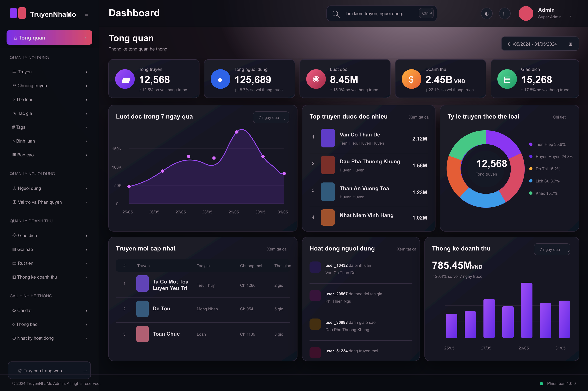

# Admin Visual 01 V2: Ruby Noir Dashboard

## Implementation Source Of Truth

This file is the selected visual reference. Implementation must follow:

- `docs/ADMIN_PANEL_SPEC.md`
- `docs/ADMIN_PANEL_TASKS.md`

Do not copy SVG pixels directly. The SVG is allowed to have visual-reference imperfections; the implementation spec owns Vietnamese copy, responsive layout, accessibility, API contracts, and security requirements.

## Design Read

This redesign keeps the Ruby Noir mood from the current public site, but uses the fuller dashboard structure from `visual/admin-dashboard.png`. The result is a real admin landing screen, not just a narrow story operations queue.

## What Changed From The Earlier Visual 01

The earlier Ruby Ops concept had the right color vibe but missed too many admin dashboard features. V2 now includes:

- grouped sidebar navigation
- top search with command hint
- theme, notification, and admin profile controls
- date range filter
- 5 KPI cards
- reads line chart
- top stories ranking
- genre distribution donut
- recently updated stories table
- user activity feed
- revenue bar chart
- footer/version status

## First Screen Layout

- Sidebar width: 242px.
- Topbar height: 66px.
- Content starts with page title and date range.
- KPI row uses five equal cards.
- Main dashboard uses three upper panels:
  - reads chart
  - top stories
  - genre distribution
- Lower dashboard uses three panels:
  - recently updated stories
  - user activity
  - revenue chart

## Visual System

- Canvas: `#090B11`, `#171119`, `#43203A`
- Sidebar: `#0C0E15`
- Panel surface: `#1D1B27` to `#111620`
- Inner surface: `#141823`
- Border: `#302A3C`
- Text primary: `#FFF7FA`
- Text secondary: `#A79BA5`
- Text muted: `#7E7480`
- Ruby accent: `#D94A64`
- Violet accent: `#8A36F2`
- Gold accent: `#FFB23D`
- Success accent: `#46C885`
- Radius: 8px navigation, 10px metric cards, 12px dashboard panels.

## Component Map

- `AdminShell`
- `AdminSidebar`
- `AdminTopbar`
- `DashboardDateRange`
- `MetricCard`
- `ReadsLineChart`
- `TopStoriesList`
- `GenreDistributionChart`
- `RecentStoriesTable`
- `UserActivityFeed`
- `RevenueBarChart`
- `AdminFooterStatus`

## Data Contracts

Data contracts are owned by `docs/ADMIN_PANEL_SPEC.md`.

V2 dashboard MVP renders only 5 KPI cards and 6 dashboard panels. Revenue breakdown, story/chapter mutations, and Marketing contracts live in dedicated spec sections so implementation does not accidentally treat the visual reference as an API contract.

## Implementation Notes

- The first implementation can use static/mock dashboard data to lock layout.
- The real admin dashboard query should be server-only.
- Do not import the Supabase secret client into Client Components.
- Revenue panels can stay mocked/deferred until payment and ledger exist.
- Use simple SVG/CSS charts first. Avoid adding a chart dependency until there is a concrete need.
- Keep tables semantic so later sorting/filtering does not require rewriting markup.

## Security Requirements

- `/admin` must be protected server-side.
- Do not rely on `raw_user_meta_data` for admin authorization.
- Admin content writes must use server-only actions and the isolated admin client.
- Every privileged mutation should validate input, authorize server-side, write audit, and revalidate affected public routes.

## Responsive Rules

- Desktop: full sidebar and 5 KPI cards.
- 1024px: sidebar can collapse to icon rail; KPI row becomes 3 plus 2.
- 768px: sidebar drawer; dashboard panels stack into two columns.
- 320px: one column; tables become stacked rows; search moves into command drawer.

## Verification Plan

- `npx.cmd tsc --noEmit`
- `npm run lint`
- `npm run build`
- Playwright:
  - unauthenticated user cannot access `/admin`
  - authorized admin sees dashboard shell
  - dashboard labels render
  - mobile sidebar opens and closes

## Best Next Skills

- `planning-and-task-breakdown`
- `supabase:supabase`
- `vercel:nextjs`
- `api-and-interface-design`
- `security-and-hardening`
- `frontend-ui-engineering`
- `test-driven-development`
