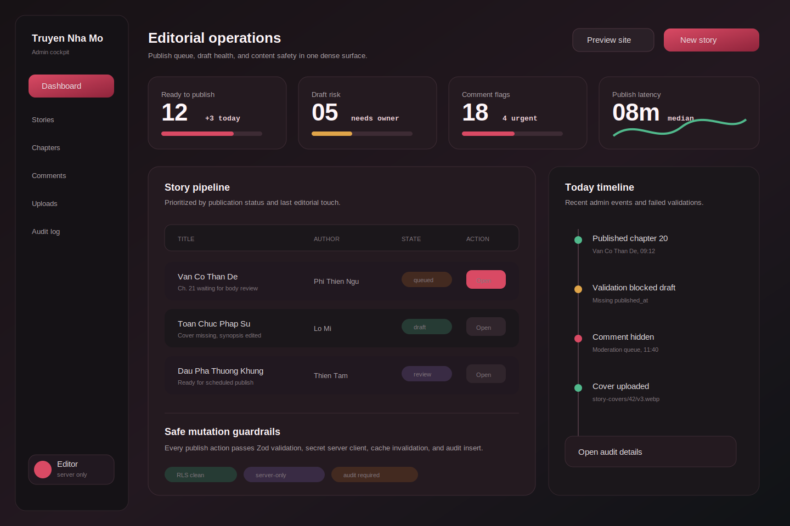

# Admin Visual 01: Ruby Ops Cockpit

## Design Read

This direction treats admin as an editorial operations cockpit: dense, dark, serious, and close to the existing Ruby Noir public identity without feeling decorative. It is best if the first admin milestone focuses on story and chapter publishing safety.

## When To Choose This

- You want admin to feel like the private back office of the current Ruby Noir product.
- B4.1 is the immediate target: server-only story/chapter create, update, publish, archive.
- Editors need fast visibility into draft risk, publish queue, failed validation, and recent admin events.

## First Screen

- Left fixed sidebar: Dashboard, Stories, Chapters, Comments, Uploads, Audit log.
- Header: page title, `Preview site`, `New story`.
- Top metrics: Ready to publish, Draft risk, Comment flags, Publish latency.
- Main table: Story pipeline with title, author, state, and open action.
- Right rail: Today timeline for audit events and failed validation.
- Bottom guardrail strip: RLS clean, server-only, audit required.

## Visual System

- Canvas: `#171215`, `#231820`, `#101316`
- Surface: `#241A20`
- Raised surface: `#1B171B`
- Border: `#3D2B34`
- Primary text: `#FFF7FA`
- Secondary text: `#AFA4AA`
- Accent: ruby `#D94A64`
- Status colors: green `#51B98C`, amber `#E0A549`, violet `#D5B5FF`
- Radius: 12px controls, 18px panels, 20px major regions
- Typography: `Geist` for UI, `Geist Mono` for IDs, counters, timestamps

## Component Map

- `AdminShell`: sidebar, header, constrained content frame.
- `AdminMetricCard`: label, value, delta, optional sparkline/progress.
- `StoryPipelineTable`: server-rendered table with keyset pagination.
- `StoryStateBadge`: draft, queued, review, published, archived.
- `AdminAuditTimeline`: recent mutation events.
- `ServerGuardrailStrip`: non-interactive trust/status summary.

## Data And Mutation Scope

- Query stories with author, latest chapter, publication status, updated timestamp.
- Mutations should be Server Actions only: `createStory`, `updateStory`, `publishStory`, `archiveStory`.
- Secret Supabase client stays in `src/lib/supabase/admin.ts`.
- Validate payloads with Zod at the action boundary.
- Insert audit event after successful privileged mutation.
- Revalidate affected public routes after publish/archive.

## Responsive Rules

- Desktop: sidebar 206px, content 3-column metric grid, right audit rail.
- Tablet: collapse metrics to 2 columns, move timeline below table.
- Mobile: drawer sidebar, metric carousel, table becomes stacked story rows.
- Admin is allowed to be dense on desktop, but touch targets stay at least 44px on mobile.

## Implementation Checklist

- Build `/admin` protected route after server-only auth model is defined.
- Keep all content writes out of browser clients.
- Use `button` elements for every action, never clickable divs.
- Add loading skeletons for metric cards and table rows.
- Add empty states for no drafts, no queued items, no audit events.
- Add error banners for failed validation or failed mutation.
- Add Playwright coverage for blocked unauthenticated admin access and one publish flow.

## Verification

- `npm run db:test`
- `npx.cmd tsc --noEmit`
- `npm run lint`
- `npm run build`
- Playwright: admin route auth guard, story draft edit, publish, public story appears.

## Best Next Skills

- `supabase:supabase`
- `vercel:nextjs`
- `api-and-interface-design`
- `security-and-hardening`
- `frontend-ui-engineering`
- `test-driven-development`
