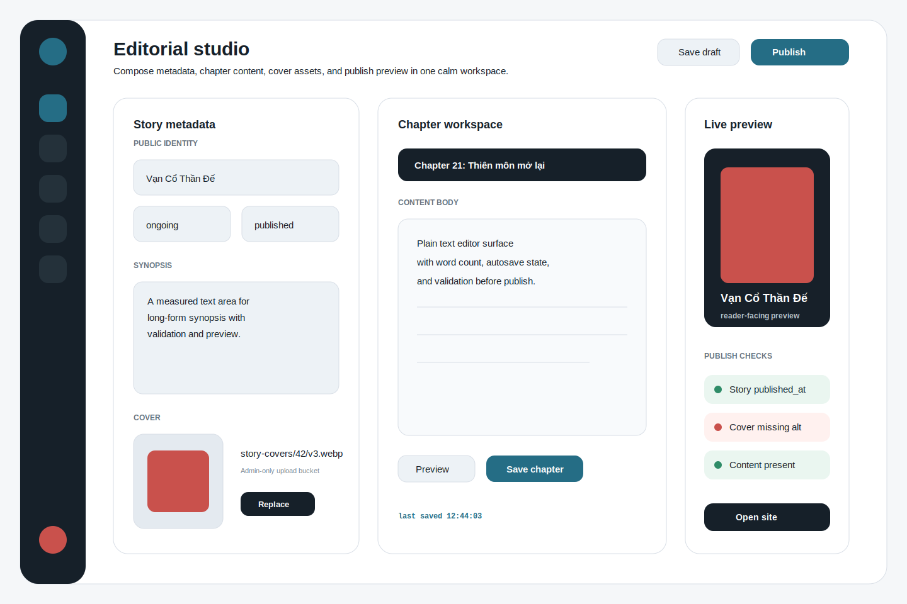

# Admin Visual 02: Editorial Studio

## Design Read

This direction treats admin as a calm authoring studio: lighter, form-forward, and optimized for careful editing instead of broad operations monitoring. It is best if the next phase should make editors comfortable creating and revising stories and chapters.

## When To Choose This

- You want the first admin experience to focus on content creation quality.
- The core workflow is story metadata plus chapter content editing.
- You prefer a quieter, readable admin UI that does not compete with long text entry.

## First Screen

- Compact dark icon rail for primary admin modules.
- Story metadata form on the left.
- Chapter workspace in the center with a large content editor.
- Live preview and publish checks on the right.
- Header actions: `Save draft`, `Publish`.

## Visual System

- Canvas: `#F5F7F9`
- Surface: `#FFFFFF`
- Soft input surface: `#EDF2F6`
- Ink: `#162029`
- Secondary text: `#63717D`
- Border: `#D8DEE6`
- Primary accent: blue-green `#256D85`
- Destructive/warning accent: coral `#C9514C`
- Success: `#2F8C68`
- Radius: 13px controls, 16px inputs, 22px panels, 28px shell
- Typography: `Geist` for UI and body, `Geist Mono` for save timestamps and IDs

## Component Map

- `AdminShell`: icon rail, header actions, content slots.
- `StoryMetadataForm`: title, slug, author, status, synopsis, genre picker, cover picker.
- `ChapterEditorPanel`: chapter number, title, access level, body editor, save state.
- `PublishChecklist`: validation result list.
- `StoryPreviewCard`: rendered public-facing preview.
- `CoverUploadControl`: admin-only storage upload control.

## Data And Mutation Scope

- Story form writes through server-only `upsertStoryDraft`.
- Chapter editor writes through server-only `upsertChapterDraft`.
- Publish action calls one orchestration action that validates story, chapter, content, and cover requirements.
- Storage write is admin-only via bucket `story-covers`.
- Avoid autosaving directly from client to Supabase; use a debounced Server Action or explicit save.
- Public preview can be server-rendered from draft payload, not from published RLS query.

## Responsive Rules

- Desktop: 3 working columns.
- Tablet: metadata and preview become tabs, editor stays primary.
- Mobile: not a primary authoring target, but must support view/edit basics in a single-column stack.
- Content editor height should use `min-height`, not viewport-locked height.

## Implementation Checklist

- Decide whether chapter body editing is `textarea` first or a richer markdown editor later.
- Add Zod validators for story metadata and chapter payloads before UI.
- Add optimistic "saved" state only after action success.
- Keep publish check results explicit and actionable.
- Add keyboard-safe form navigation and visible focus rings.
- Add unsaved-change guard before navigation.

## Verification

- Unit tests for validators.
- Integration test for draft create/update with server-only admin client.
- Playwright: admin opens story draft, edits synopsis, saves chapter body, sees publish checklist.
- Build/lint/typecheck before PR.

## Best Next Skills

- `api-and-interface-design`
- `security-and-hardening`
- `frontend-ui-engineering`
- `test-driven-development`
- `supabase:supabase`
- `vercel:nextjs`
