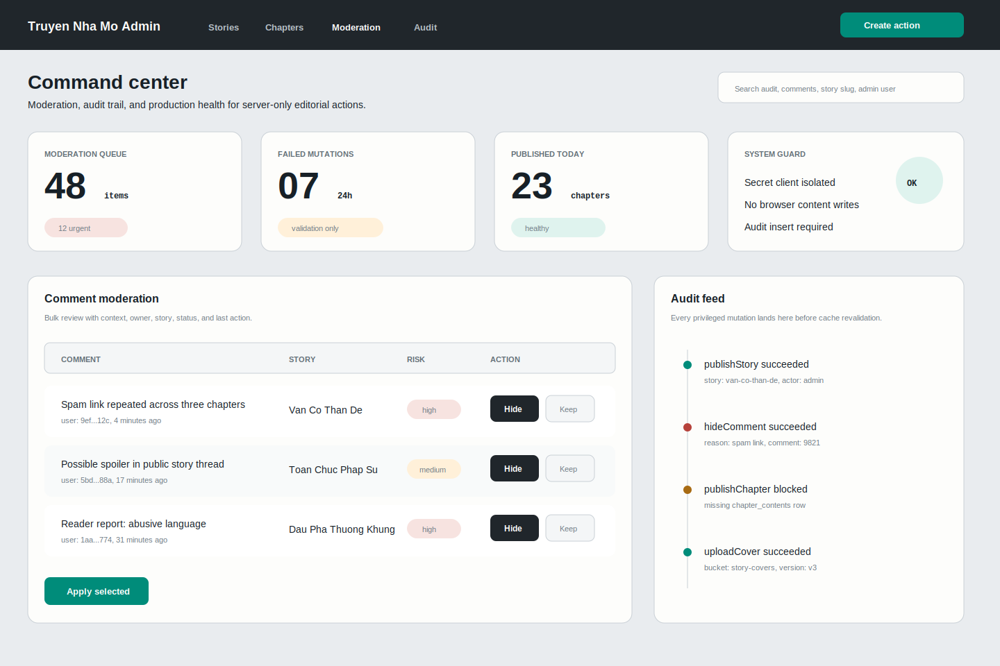

# Admin Visual 03: Command Center

## Design Read

This direction treats admin as a high-density production command center: moderation-first, audit-heavy, and optimized for repeat operational work. It intentionally feels more like an internal tool than a branded editorial surface.

## When To Choose This

- You want comments moderation and auditability to be first-class from the start.
- Admin users need dense scanning, bulk actions, and clear risk levels.
- The platform may soon need production hardening, security review, and policy traceability.

## First Screen

- Top horizontal navigation: Stories, Chapters, Moderation, Audit.
- Search across audit, comments, story slug, admin user.
- Metric row: Moderation queue, failed mutations, published today, system guard.
- Main table: comment moderation with risk level and actions.
- Right rail: audit feed for privileged mutations.
- Primary action: `Apply selected` for bulk moderation.

## Visual System

- Canvas: `#E9ECEF`
- Top nav: `#20262B`
- Surface: `#FDFDFB`
- Secondary surface: `#F4F6F7`
- Ink: `#172027`
- Secondary text: `#626E76`
- Border: `#C9D0D6`
- Primary accent: teal `#008C7A`
- Risk high: `#B6423B`
- Risk medium: `#A86B13`
- Radius: 8px buttons, 10px table rows, 14px panels
- Typography: `Geist` for UI, `Geist Mono` for IDs and audit metadata

## Component Map

- `AdminTopNav`: horizontal nav and global search.
- `OpsMetricTile`: compact production counters.
- `ModerationQueueTable`: selectable rows, risk badges, row actions.
- `BulkActionBar`: appears when rows are selected.
- `AuditFeed`: chronological mutation events.
- `SystemGuardPanel`: static server/security posture summary.

## Data And Mutation Scope

- Moderation query reads `comments` joined to story and profile context through server-side query helpers.
- Moderation mutations are server-only: `hideComment`, `restoreComment`, `deleteCommentAsModerator`.
- Audit feed records mutation type, actor, entity, result, reason, and timestamp.
- Bulk actions must validate selected IDs server-side and return per-row results.
- Public user comment edit/delete remains separate from moderator actions.

## Responsive Rules

- Desktop: table plus audit rail.
- Tablet: audit feed becomes a bottom panel; top metrics become 2 by 2.
- Mobile: moderation rows become stacked cards with one primary action per row.
- Bulk actions should stay sticky at the bottom on narrow viewports.

## Implementation Checklist

- Add admin audit table or equivalent before shipping moderation actions.
- Define moderator action reason enum.
- Add Zod validation for comment IDs and reason.
- Ensure hidden comments stay invisible to public RLS.
- Prevent raw database error leakage in moderation UI.
- Add keyboard support for row selection and bulk action confirmation.

## Verification

- SQL tests: public cannot read hidden comments, owner cannot unhide hidden comments, admin server can hide/restore through trusted path.
- Playwright: moderator hides a comment, public story page no longer shows it, audit feed shows event.
- Typecheck, lint, build.
- Supabase advisors after any schema or policy change.

## Best Next Skills

- `security-and-hardening`
- `supabase:supabase`
- `api-and-interface-design`
- `frontend-ui-engineering`
- `test-driven-development`
- `code-review-and-quality`
